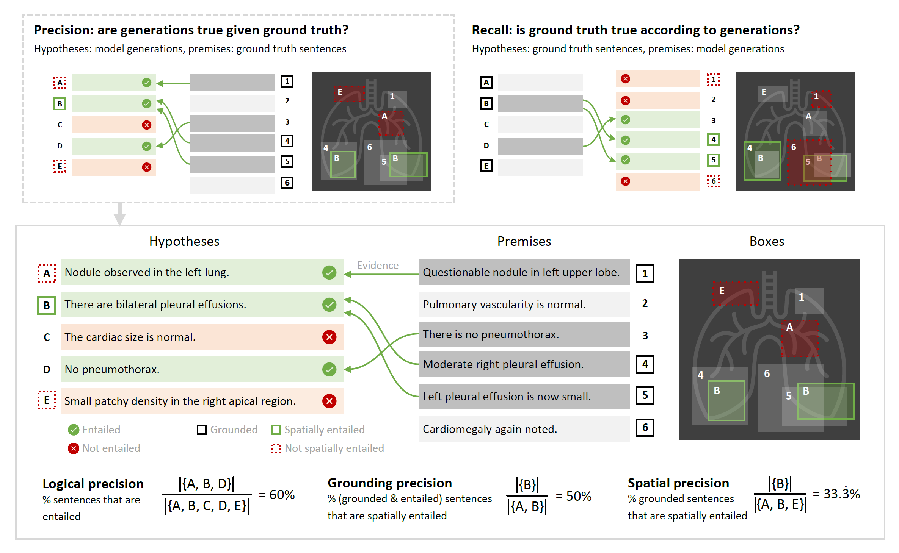

# RadFact: An LLM-based Evaluation Metric for AI-generated Radiology Reporting

RadFact is a framework for the evaluation of model-generated radiology reports given a ground-truth report, **with or without grounding**. Leveraging the logical inference capabilities of large language models, RadFact is not a single number but a _suite_ of metrics, capturing aspects of precision and recall at text-only and text-and-grounding levels.

RadFact was introduced in [MAIRA-2: Grounded Radiology Report Generation](https://aka.ms/maira-2). Here we provide an open-source implementation of the metric to facilitate its use and development.

## Table of Contents

- [Getting Started](#getting-started)
  - [Installation](#installation)
  - [Endpoint (LLM) setup](#endpoint-llm-setup)
    - [Endpoint authentication](#endpoint-authentication)
    - [Set up endpoint config(s)](#set-up-endpoint-configs)
    - [Confirm entailment verification is working](#confirm-entailment-verification-is-working)
    - [`LLMEngine` for parallel processing](#llmengine-for-parallel-processing)
  - [Running RadFact](#running-radfact)
  - [Split reports into phrases](#split-reports-into-phrases)
- [What is RadFact?](#what-is-radfact)
- [Citation](#citation)
- [Links](#links)
- [Disclaimer](#disclaimer)
- [Contributing](#contributing)
- [Trademarks](#trademarks)

## Getting Started

### Installation

In order to run RadFact, you just need to clone this repository and run the following command:

```bash
pip install .
```

This will install the `radfact` package and all its dependencies.

Alternatively, we provide a `Makefile` to set up a conda environment with all the dependencies. You can create the environment with:

```bash
make miniconda
make mamba
make env
conda activate radfact
```

The first step installs miniconda, the second installs mamba for fast dependency resolution, and the third creates a conda environment called `radfact` with all the dependencies. This will also install the radfact package in editable mode by default via `setup_packages_with_deps` recipe (see [Makefile](Makefile#L28)). Finally, activate the environment for running RadFact. This is highly recommended if you intend to [contribute to the project](#contributing).

### Endpoint (LLM) setup

To use RadFact, you need access to a large language model. You need to first set up the endpoints with authentication, and then confirm they are behaving as expected using our test script.

The LLM should be available as an API endpoint and be supported by `langchain` (version 0.1.4). We support two types of models: [AzureChatOpenAI](https://python.langchain.com/v0.1/docs/integrations/chat/azure_chat_openai/) and [ChatOpenAI](https://python.langchain.com/v0.2/docs/integrations/chat/openai/) models. The former is suitable for GPT models available on Azure, while the latter is suitable for custom deployed models like Llama-3 in Azure.

#### Endpoint authentication

We support the following authentication methods:

- **API Key environment variable:** Set the `API_KEY` environment variable to the API key of the endpoint. We use `API_KEY` as the default environment variable name. If you use a different name, you can specify it in the endpoint config via `api_key_env_var_name`. This is especially useful when using multiple endpoints with different API keys.
- **API Key from an Azure Key Vault:** Retrieve the API key from the default Azure Key Vault of an AzureML workspace. This requires:
    1. Adding an AzureML workspace configuration file `config.json` in the root directory of the project. This config should have keys `subscription_id`, `resource_group`, and `workspace_name`. It can be downloaded from the AzureML workspace via the portal. This file is added to the `.gitignore` to avoid accidental commits. Make sure to save the file in root directory of the project under the name `config.json` as expected by the [endpoint](src/radfact/llm_utils/endpoint.py#L38) class.
    2. Specifying the `key_vault_secret_name` in the endpoint config.
- **Token-based authentication via Azure token provider:** This relies on token-based authorization. If none of the above methods are set up, we fall back to generating an Azure token provider assuming you have the right Azure credentials set up. The token provider is set to the `azure_ad_token_provider` parameter of an `AzureChatOpenAI` model allowing automatic token refresh. This is only supported for `AzureChatOpenAI` models.

To learn more about how we integrate the enpoints within RadFact please refer to the `LLMAPIArguments` class in [arguments.py](src/radfact/llm_utils/engine/arguments.py) that consumes an endpoint object of the `Endpoint` class in [endpoint.py](src/radfact/llm_utils/endpoint.py).

#### Set up endpoint config(s)

We use [hydra](https://hydra.cc/) for config management. The endpoint configs are in the  path: [`configs/endpoints`](configs/endpoints).

This is an example of config file:

```yaml
ENDPOINT_EXAMPLE:
  type: "CHAT_OPENAI"
  url: "<your_url>"
  deployment_name: "llama3-70b"
  api_key_env_var_name: "<your_api_key_env_var_name>"
  keyvault_secret_name: "<your_keyvault_secret_name_if_using>"
  speed_factor: 1.0
  num_parallel_processes: 10
```

- There are 2 types of endpoints `type: "CHAT_OPENAI"` and `type: "AZURE_CHAT_OPENAI"` depending on the model end-point used. For GPT models available on Azure, use `type: "AZURE_CHAT_OPENAI"`. For custom deployed models like Llama-3 on Azure, use `type: "CHAT_OPENAI"`.
- You will need to update the `url` and likely `deployment_name` fields with the appropriate values.
- `keyvault_secret_name` is optional and not required if you set the api via an environment variable. Update `api_key_env_var_name` if you use a different environment variable name for the API key than the default `"API_KEY"`. When using multiple endpoints, specify different `api_key_env_var_name` for each endpoint.
- The option `speed_factor` is used when more than one endpoint is available. This allows you to specify the relative speed of the endpoint compared to the others which is used to shard the data across the endpoints proportionally.
- The option `num_parallel_processes` is used to specify the number of parallel processes to use when querying a specific endpoint. All requests are processed sequentially unless `num_parallel_processes` is set to a value greater than 1 which allows for parallel processing.

As above, when using RadFact for evaluation of _non-grounded_, e.g. narrative reports, RadFact first converts reports to a list of phrases. We use an LLM for this step, but it does not need to be the same LLM as used for entailment verification. You can specify which endpoint (hence LLM) is used for each task in the following configs, under `override endpoints: <endpoint config>`:

- [`configs/report_to_phrases.yaml`](configs/report_to_phrases.yaml) -- conversion of report to list of phrases. In MAIRA-2, we used GPT-4 for this that can be queried as an AzureChatOpenAI model.
- [`configs/radfact.yaml`](configs/radfact.yaml) -- entailment verification. In MAIRA-2, we used `LLama-3-70B-Instruct` for this that can be queried as a ChatOpenAI model.

#### Confirm entailment verification is working

Different back-end LLMs may behave differently and produce different metric results. In particular, a model which performs poorly at entailment verification should not be used for RadFact. To confirm that entailment verification is behaving as expected, run `python src/radfact/cli/run_radfact_test_examples.py` and confirm the results are similar to those expected. The expected results were obtained using the `LLama-3-70b-Instruct` model.

Note that this does not test the behaviour of the report-to-phrases step.

#### LLMEngine for parallel processing

The [`LLMEngine`](src/radfact/llm_utils/engine/engine.py#L50) class enables parallel processing across multiple endpoints. If you have access to multiple endpoints with different throughput, the engine can shard the data across the endpoints proportionally to their speed. The engine also allows for parallel processing of requests to a single endpoint. This is used by default regardless of the number of endpoints. Refer to the endpoints config file for the `speed_factor` and `num_parallel_processes` options. Additionally, the engine takes care of batch processing and intermediate caching of results. All intermediate results are stored in the `outputs/radfact` directory under a run id folder tagged with the starting timestamp e.g. `outputs/radfact/run_20240814_075225`. The folder structure is as follows:

```
  outputs/radfact/run_20240814_075225
  ├── batch_outputs
  │   ├── outputs_0_100.json
  |   ├── .
  |   ├── .
  |   ├── .
  │   └── outputs_1000_1100.json
  ├── progress
  │   ├── subset_0_240.csv
  |   ├── .
  |   ├── .
  |   ├── .
  │   └── subset_800_1100.csv
  ├── skipped
  │   ├── subset_0_240.csv
  |   ├── .
  |   ├── .
  |   ├── .
  │   └── subset_800_1100.csv
  ├── outputs.json
  ├── progress.csv
  └── skipped.csv
```

`outputs.json` contains the final results for all the data points. `progress.csv` contains the progress of the processing for each endpoint. `batch_outputs` contains the intermediate results per batch size. `skipped` contains the data points that were skipped due to errors.

### Running RadFact

You can refer to the [getting_started](getting_started.ipynb) notebook to see how to run RadFact on your own data. We highly recommend reading the notebook first to understand the RadFact workflow and how to use it. We also provide a script to run RadFact on your data. Make sure you've set up the endpoints as described above before running the script. `run_radfact` command runs `python src/radfact/cli/run_radfact.py` script under the hood. You can override the default behavior via the command line arguments explained below by running `run_radfact --help`. You need to have the package installed locally in order to run the script.

```bash
$ run_radfact --help
usage: run_radfact [-h] [--radfact_config_name RADFACT_CONFIG_NAME] [--phrases_config_name PHRASES_CONFIG_NAME] --input_path INPUT_PATH [--is_narrative_text] [--output_dir OUTPUT_DIR] [--bootstrap_samples BOOTSTRAP_SAMPLES]

Compute RadFact metric for a set of samples and saves the results to a json file.

options:
  -h, --help            show this help message and exit
  --input_path INPUT_PATH
                        The path to the csv or json file containing the samples to compute RadFact for. For finding generation samples, the csv file should have columns 'example_id',
                        'prediction', and 'target' similar to the example in `examples/findings_generation_examples.csv`. For grounded reporting samples, provide a json file in the
                        same format as `examples/grounded_reporting_examples.json`.
  --is_narrative_text   Whether the input samples are narrative text or not. If true, the input samples are expected to be narrative text, otherwise they are expected to be grounded
                        phrases.
  --radfact_config_name RADFACT_CONFIG_NAME
                        The name of the config file for RadFact processing. We use the default config file but you can provide a custom config. Make sure the config follows the same
                        structure as `configs/radfact.yaml` and is saved in the `configs` directory. This is necessary for hydra initialization from the `configs` directory.
  --phrases_config_name PHRASES_CONFIG_NAME
                        The name of the config file for reports to phrases conversion. We use the default config file but you can provide a custom config. Make sure the config follows
                        the same structure as `configs/report_to_phrases.yaml` and is saved in the `configs` directory. This is necessary for hydra initialization from the `configs`
                        directory.
  --output_dir OUTPUT_DIR
                        Path to the directory where the results will be saved as a json file.
  --bootstrap_samples BOOTSTRAP_SAMPLES
                        Number of bootstrap samples to use for computing the confidence intervals. Set to 0 to disable bootstrapping.
```

- for non-grounded reports (findings generation narrative text):

```bash
  run_radfact --input_path <path_to_input_file.csv> --is_narrative_text
```

- for grounded reports:

```bash
  run_radfact --input_path <path_to_input_file.json>
```

Refer to the example input files in the [`examples`](examples) directory for the expected format of the input files. The input files should be in the format of a CSV file for non-grounded reports [findings_generation_examples.csv](examples/findings_generation_examples.csv) and a JSON file for grounded reports [grounded_reporting_examples.json](examples/grounded_reporting_examples.json).

The script computes confidence intervals for the metrics using bootstrapping. The number of bootstrap samples can be controlled using the `--bootstrap_samples` argument. The default value is 500. To disable bootstrapping, set `--bootstrap_samples 0`.

⚠️**WARNING**: Some queries may fail due to the endpoint limitations (timeouts, rate limits, etc.). When the LLM performing entailment verification fails, we **set these examples as not-entailed by default**. If this occurs in a significant number of cases, the results will not be reliable. The final metrics dict contains the number of such skipped queries under the key `num_llm_failures`. The script will print the number of skipped queries at the end of the run, and store these in the `skipped` directroy under the run id folder. You will also see a warning message in the logs for each failed query. `WARNING: No response for example {query_id}. Setting as NOT ENTAILED`.

### Split reports into phrases

We also provide a script to convert reports to phrases. This is useful when you have a narrative report and want to convert it to a list of phrases for RadFact evaluation. You can run this step offline and then use the output file as input to RadFact. Make sure you've set up the endpoints as described above before running the script. The `run_report_to_phrases` command runs `python src/radfact/cli/run_report_to_phrases.py` script under the hood.

```bash
  run_report_to_phrases dataset.csv_path=<your_path_to_cxr_reports>
```

This script is configurable using the `report_to_phrases.yaml` config file. You can specify the input file, output file, and the endpoint to use for the conversion.

## What is RadFact?



If necessary, RadFact first breaks reports into individual sentences describing at most one finding. It then uses the logical inference capabilities of a large language model to determine whether these sentences are logically supported ('entailed') given the reference report. We compute this in two directions, first using the ground truth (original) report as the reference, and vice-versa, using the model generated report as the reference. This allows for the quantification of both correctness and completeness.

Overall, RadFact provides six measures of (grounded) report quality:

| Metric | Definition | What does it tell us? | Grounding? |
| --- | --- | --- | --- |
| **Logical** precision | The fraction of generated sentences that are entailed by the ground-truth report. | How truthful the model generations are: it penalises incorrect generations. | ❌ |
| **Logical** recall | The fraction of ground-truth sentences that are entailed by the generated report. | How complete the generated report is: it penalises omissions. | ❌ |
| **Grounding** precision | The fraction of logically entailed grounded generated sentences that are also spatially entailed. | How often are correctly-_generated_ findings **also** correctly grounded? | ✔️ |
| **Grounding** recall | The fraction of logically entailed grounded ground-truth sentences that are also spatially entailed. | How often are correctly-_captured_ findings **also** correctly grounded? | ✔️ |
| **Spatial** precision | The fraction of _all_ grounded generated sentences that are both logically and spatially entailed. | A low score means the model has generated unnecessary boxes or boxes for incorrect sentences. | ✔️ |
| **Spatial** recall| The fraction of _all_ grounded ground-truth sentences that are both logically and spatially entailed. | A low score means the model failed to generate boxes for findings in the reference, potentially by describing the finding incorrectly or not at all.  | ✔️ |

Spatial {precision, recall} are less immediately interpretable than the other metrics, but we include them to control for the denominator implicit in the grounding {precision, recall}: If we only assess the quality of boxes of **logically entailed** sentences as measured by grounding {precision, recall}, we do not capture grounding failures arising from extraneous boxes associated with incorrect sentences (e.g. entirely fabricated findings), or missing boxes associated with missed findings.

### How does it work?

RadFact uses LLMs in two steps. In both cases, we use around 10 few-shot examples.

1) Convert a report to a list of individual sentences describing at most one finding. The few-shot examples are sourced from synthetic findings in the style of [MIMIC-CXR](https://physionet.org/content/mimic-cxr/2.0.0/). The original MIMIC reports are protected under a data use agreement that prohibits redistribution. Hence, the use of synthetic reports. This step is **not required** for grounded reporting scenarios, where we expect the report is _already_ formatted as a list of sentences (each potentially with bounding boxes).
2) Perform entailment verification. We do this in two directions, using either the ground truth report as the reference (giving precision metrics), or using the model-generated report as the reference (giving recall metrics).

Single-directional entailment verification (part of step 2) works as follows:

1) For each sentence in the candidate report: given all sentences in the reference report, we query the LLM with something like: 'Is this sentence entailed? If yes, provide supporting evidence'. The supporting evidence are sentences from the reference report.
2) To compute spatial entailment, we use the evidence. A sentence is spatially entailed if its box is _sufficiently contained_ within the union of its evidence. In practice, this means we require a pixel precision of above 0.5, e.g. at least 50% of the pixels in the candidate box are within the evidence boxes.

This allows us to label every sentence as logically entailed (or not) and spatially entailed (or not), and hence compute the RadFact metrics listed above. Note that spatial entailment is only defined for sentences with boxes.

#### Where did we get the few-shot examples?

For conversion of reports into individual sentences, we generated synthetic examples in the style of [MIMIC-CXR](https://physionet.org/content/mimic-cxr/2.0.0/) reports, using the `FINDINGS` section. The original MIMIC reports are protected under a data use agreement that prohibits redistribution. We manually split the narrative reports into individual sentences. The examples and system message can be seen under `llm_utils.report_to_phrases.prompts`.

For entailment verification, the few-shot examples are sourced from a private dataset ("USMix"). Each example contains sentences from two reports, which we selected to be similar but not identical using tf-idf statistics. In collaboration with a consultant radiologist, we then manually labelled them with entailment status and evidence. Despite being a logical inference task, there is a degree of subjectivity in entailment verification, arising from how strictly certain concepts are interpreted. Hence, some of these examples could be contested. Examples and system message are available under `llm_utils.nli.prompts`.

## Citation

To cite RadFact, you can use:

```bibtex
@article{Bannur2024MAIRA2GR,
  title={MAIRA-2: Grounded Radiology Report Generation},
  author={Shruthi Bannur and Kenza Bouzid and Daniel C. Castro and Anton Schwaighofer and Sam Bond-Taylor and Maximilian Ilse and Fernando P'erez-Garc'ia and Valentina Salvatelli and Harshita Sharma and Felix Meissen and Mercy Prasanna Ranjit and Shaury Srivastav and Julia Gong and Fabian Falck and Ozan Oktay and Anja Thieme and Matthew P. Lungren and Maria T. A. Wetscherek and Javier Alvarez-Valle and Stephanie L. Hyland},
  journal={arXiv},
  year={2024},
  volume={abs/2406.04449},
  url={https://arxiv.org/abs/2406.04449}
}
```

## Links

- [MAIRA-2: Grounded Radiology Report Generation](https://aka.ms/maira-2)
- [RAD-DINO model](https://aka.ms/rad-dino-model)
- [Project MAIRA](https://www.microsoft.com/en-us/research/project/project-maira/)

## Disclaimer

RadFact is provided for research use only. RadFact is not designed, intended, or made available for use in the diagnosis, prevention, mitigation, or treatment of a disease or medical condition nor to perform any medical function, and the performance of RadFact for such purposes has not been established. You bear sole responsibility for any use of RadFact, including incorporation into any product intended for a medical purpose.

## Contributing

This project welcomes contributions and suggestions.  Most contributions require you to agree to a
Contributor License Agreement (CLA) declaring that you have the right to, and actually do, grant us
the rights to use your contribution. For details, visit <https://cla.opensource.microsoft.com>.

When you submit a pull request, a CLA bot will automatically determine whether you need to provide
a CLA and decorate the PR appropriately (e.g., status check, comment). Simply follow the instructions
provided by the bot. You will only need to do this once across all repos using our CLA.

This project has adopted the [Microsoft Open Source Code of Conduct](https://opensource.microsoft.com/codeofconduct/).
For more information see the [Code of Conduct FAQ](https://opensource.microsoft.com/codeofconduct/faq/) or
contact [opencode@microsoft.com](mailto:opencode@microsoft.com) with any additional questions or comments.

## Trademarks

This project may contain trademarks or logos for projects, products, or services. Authorized use of Microsoft
trademarks or logos is subject to and must follow
[Microsoft's Trademark & Brand Guidelines](https://www.microsoft.com/en-us/legal/intellectualproperty/trademarks/usage/general).
Use of Microsoft trademarks or logos in modified versions of this project must not cause confusion or imply Microsoft sponsorship.
Any use of third-party trademarks or logos are subject to those third-party's policies.
